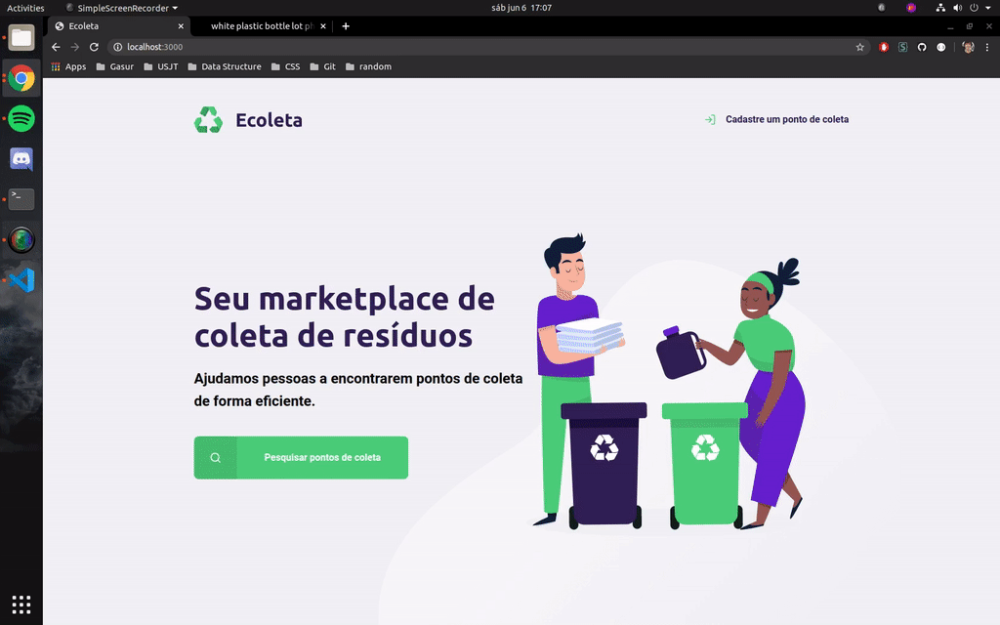

# Ecoleta
Aplicativo desenvolvido durante a Next Level Week, que foi a semana de desenvolvimento gratuita fornecida pela RocketSeat

### Preview

### Tecnologias Envolvidas
  
  SQLite3 -> Banco de Dados com a tabela de pontos cadastrados.    
  Node.js (12.18.0) -> Criação do servidor e configuração das rotas com express.    
  HTML/CSS + Nunjucks -> Páginas mais dinâmicas e reaproveitamento de código.    
